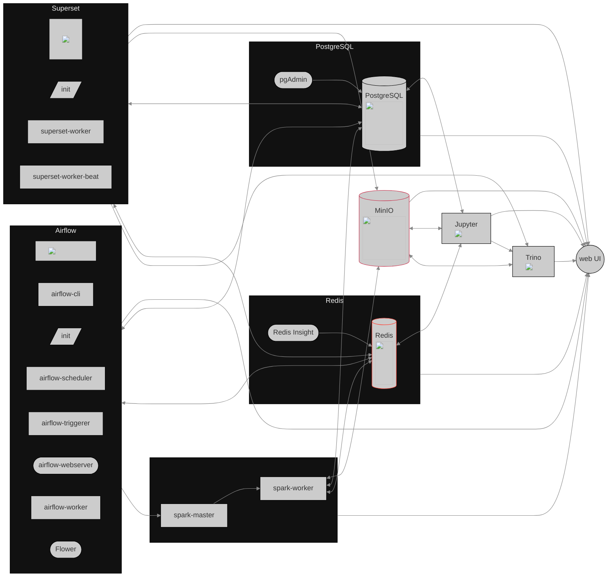

```mermaid
%%{
  init: {
    "theme": "base",
    "themeVariables": {
      "primaryColor": "#CCC",
      "primaryBorderColor": "#000",
      "lineColor": "#888",
      "secondaryColor": "#006100",
      "tertiaryColor": "#111"
    }
  }
}%%

graph LR
    %% TD or LR?
    web((web UI))
    %% web[web UI]
    minio ----> web
    g_redis --> web
    g_postgres --> web
    jupyter --> web
    g_airflow --> web
    g_spark --> web
    g_superset --> web
    trino --> web

    %% style minio fill:#f9f,stroke:#333,stroke-width:4px
    style minio stroke:#c72c48
    style redis stroke:#ff4438


    minio[("MinIO<center><img src='https://cdn.worldvectorlogo.com/logos/minio-1.svg'; padding='1000'; height='100'; width='100'';/></center>")]
    redis[("Redis<center><img src='https://cdn.worldvectorlogo.com/logos/redis.svg'; height='100'/></center>")]
    postgres[("PostgreSQL<center><img src='https://cdn.worldvectorlogo.com/logos/postgresql.svg'; height='100''/></center>")]

    redisinsight([Redis Insight])
    pgadmin([pgAdmin])

    jupyter["Jupyter<img src='https://upload.wikimedia.org/wikipedia/commons/3/38/Jupyter_logo.svg'; width='1'/>"]

    trino["Trino<img src='https://upload.wikimedia.org/wikipedia/commons/5/57/Trino-logo-w-bk.svg'; width='1'/>"]

    subgraph g_redis[Redis];
        redisinsight --> redis
    end

    subgraph g_postgres[PostgreSQL];
        pgadmin --> postgres
    end

    minio <--> jupyter
    postgres <--> jupyter
    redis <--> jupyter

    subgraph g_airflow[Airflow]
      direction LR
      logo_airflow[<img src='https://cwiki.apache.org/confluence/download/attachments/145723561/airflow_transparent.png'/>]
      airflow-cli
      airflow-init[/init/]
      airflow-scheduler
      airflow-triggerer
      airflow-webserver([airflow-webserver])
      airflow-worker
      flower([Flower])
    end
    g_airflow <----> postgres
    g_airflow <----> redis

    subgraph g_spark[<img src='https://spark.apache.org/images/spark-logo-rev.svg'/>];
      %% not using a logo node because it's just the two
      spark-master --> spark-worker
    end
    g_airflow --> spark-master
    spark-worker <--> minio
    spark-worker <--> postgres
    spark-worker <--> redis

    subgraph g_superset[Superset<br/>];
      direction LR
      superset[<br/><img src='https://upload.wikimedia.org/wikipedia/commons/0/0e/Superset_logo.svg'/><br/>]
      superset-init[/init/]
      superset-worker
      superset-worker-beat
    end
    g_superset --> minio
    g_superset <--> postgres
    g_superset <--> redis

    g_superset ------> trino
    jupyter --> trino
    trino <--> minio

```